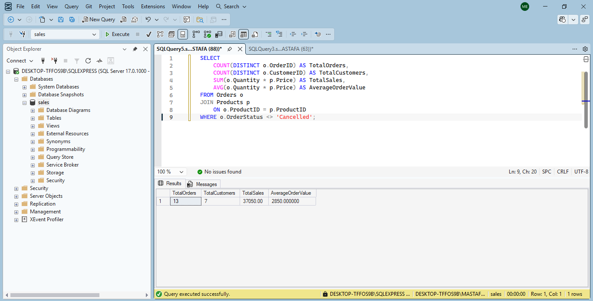
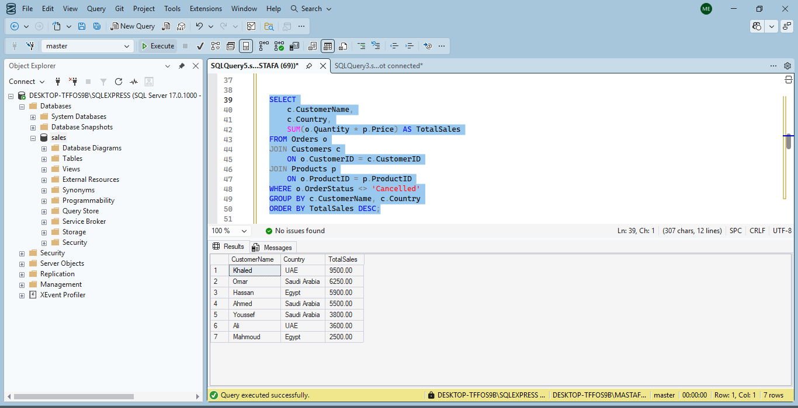
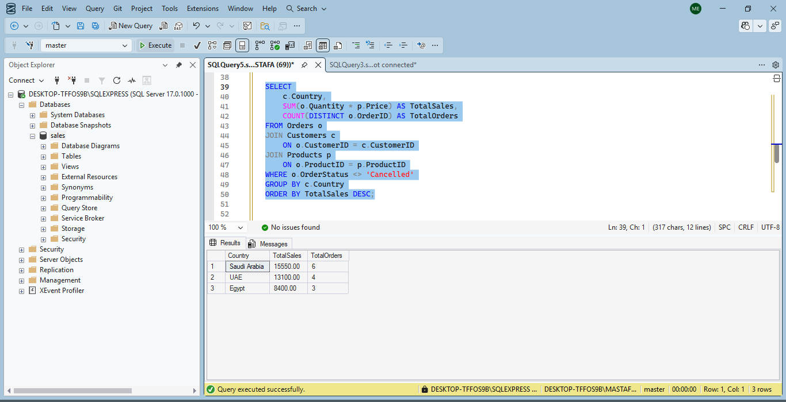
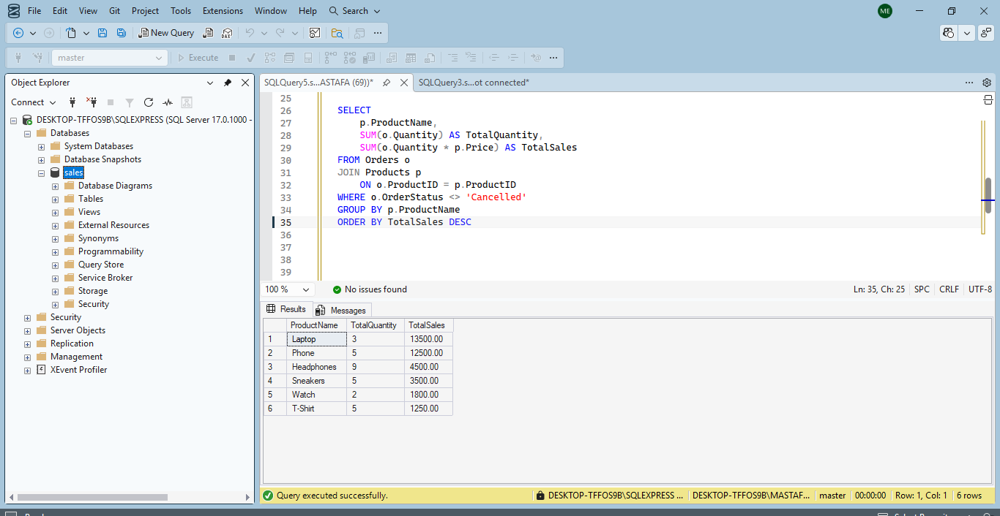
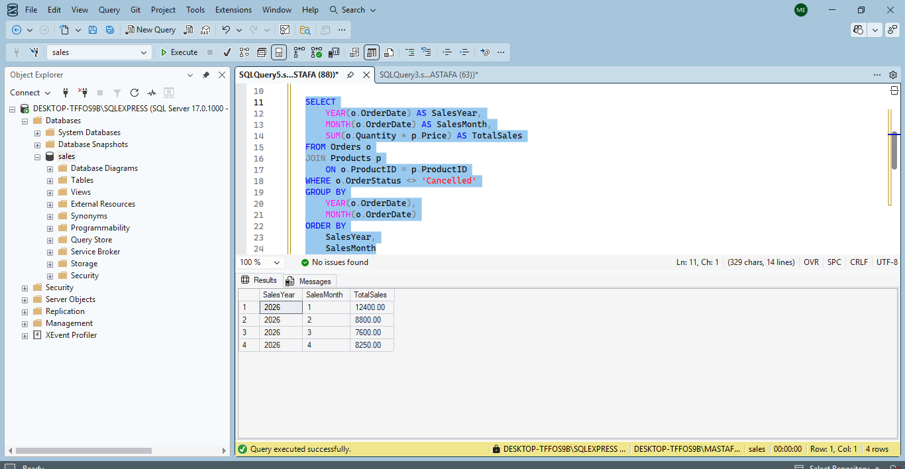

# Sales Data Analysis | SQL

## Project Overview

A SQL-based sales analysis project focused on analyzing sales performance, customers, products, orders, and sales trends.

The project demonstrates how SQL can be used to transform sales data into meaningful business insights and support data-driven decision-making.

## Business Objectives

- Analyze overall sales performance.
- Measure total orders and customers.
- Calculate Average Order Value (AOV).
- Identify top-performing customers and products.
- Compare sales performance across countries.
- Analyze monthly sales trends.

## Tools & Skills

- SQL Server
- SQL
- JOIN
- WHERE
- GROUP BY
- ORDER BY
- Aggregate Functions
- COUNT
- SUM
- AVG
- DISTINCT
- Data Analysis

## Analysis Performed

### 1. Overall Sales KPIs

Calculated key sales metrics including Total Orders, Total Customers, Total Sales, and Average Order Value (AOV).

### 2. Customer Sales Analysis

Analyzed customer sales performance by calculating total sales for each customer.

### 3. Sales by Country

Compared total sales and order volume across countries to identify the highest-performing markets.

### 4. Top Products

Identified the top-performing products based on total quantity sold and total sales.

### 5. Monthly Sales Analysis

Analyzed monthly sales performance to identify sales trends over time.

## Key Skills Demonstrated

- Writing analytical SQL queries
- Joining multiple tables
- Aggregating sales data
- Calculating business KPIs
- Filtering and grouping data
- Analyzing customer and product performance
- Extracting business insights from data

## Project Purpose

This project demonstrates practical SQL and data analysis skills through a sales analysis scenario, with a focus on business-oriented insights and performance analysis.
